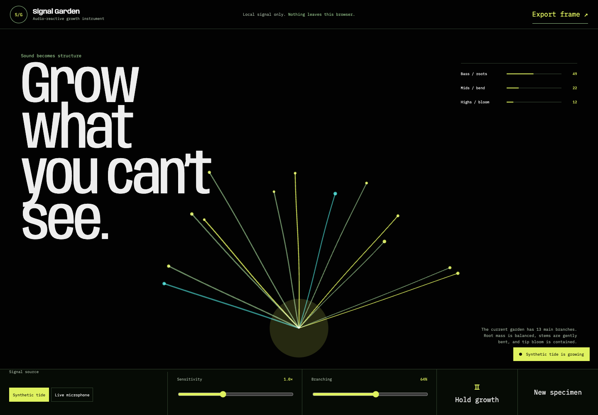

# Signal Garden

An audio-reactive generative instrument built with Web Audio, Canvas, React, and TypeScript.

Signal Garden maps frequency roles to a polar growth system. Bass controls root mass, mid frequencies bend stems, and high frequencies open luminous tips. It can listen to a microphone locally or run from a deterministic synthetic tide, then export the current composition as a PNG.



## Why this exists

Most audio visualizers decorate amplitude. Signal Garden uses a readable mapping between sound and structure, so the image explains what it heard.

## Technical highlights

- Web Audio `AnalyserNode` with frequency-band aggregation
- Deterministic generative geometry with reproducible seeds
- Device-pixel-ratio-aware Canvas renderer
- `requestAnimationFrame` render loop with React state sampled at a lower frequency
- Microphone privacy: the stream stays local and stops when the source changes
- Exportable PNG frames
- Textual equivalent of the current visual state
- Reduced-motion rendering and keyboard-complete controls

## Run it

```bash
npm install
npm run dev
```

Microphone access requires localhost or HTTPS. If permission is declined, the synthetic signal remains fully functional.

## Verify it

```bash
npm test
npm run build
```

Production Lighthouse: **99 performance · 100 accessibility · 100 best practices**.

## Architecture

`src/garden.ts` is a pure signal-to-geometry pipeline. `src/App.tsx` owns browser audio and the Canvas lifecycle. This split makes the mapping deterministic and testable without a browser audio device.

## Portfolio talking point

The visual metaphor is not applied after signal processing. It is the signal-processing model: three frequency regions control three biologically legible properties of the rendered organism.
